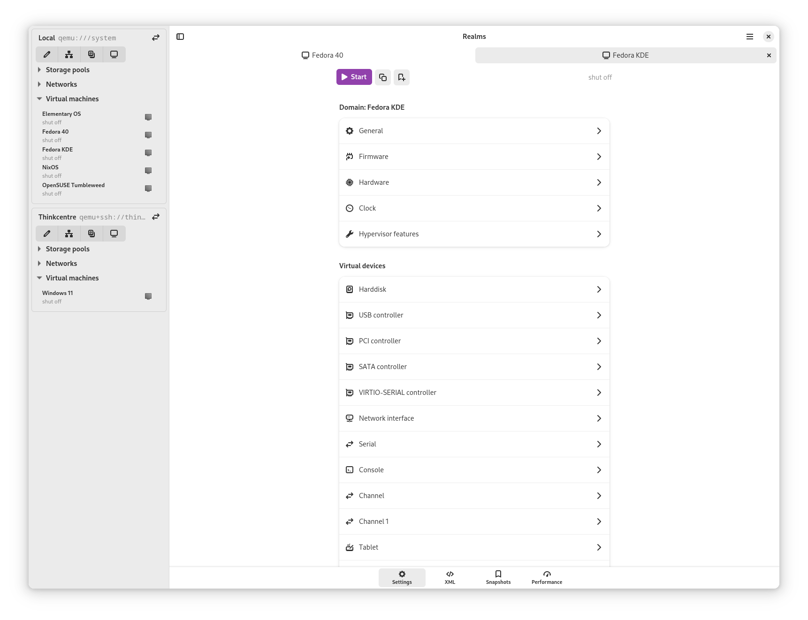

# Realms



**Realms** attempts to bring more of libvirt's features to the GNOME desktop.

> [!CAUTION]
> Absolutely nothing is stable yet. Use it at your own risk.

## Installation

>Flatpak doesn't work yet.

1. Use `meson setup build --prefix=$HOME/.local` to create the build directory
2. Use `meson install -C build` to install
3. Run as `realms`
4. Use `ninja uninstall` from the build dir to uninstall

## Flatpak

```sh
flatpak run org.flatpak.Builder --install ~/Projects/builddir com.github.marreitin.realms.yaml --user --install-deps-from=flathub repo=~/Projects/repo  --force-clean && flatpak run com.github.marreitin.realms
```
